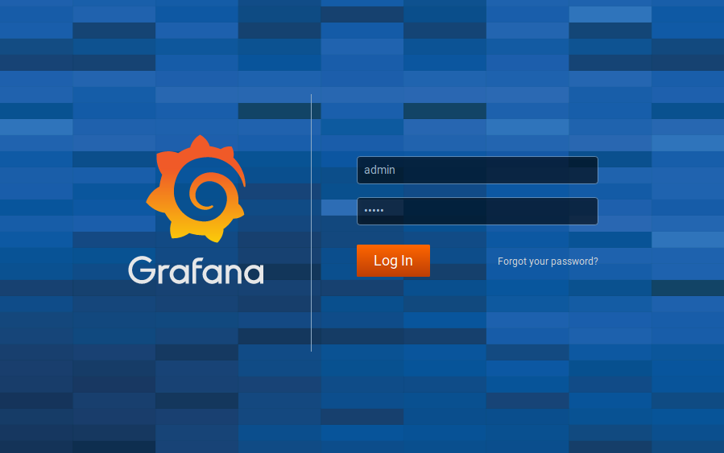
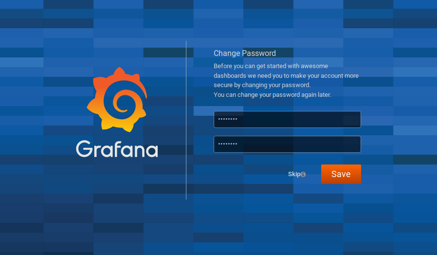
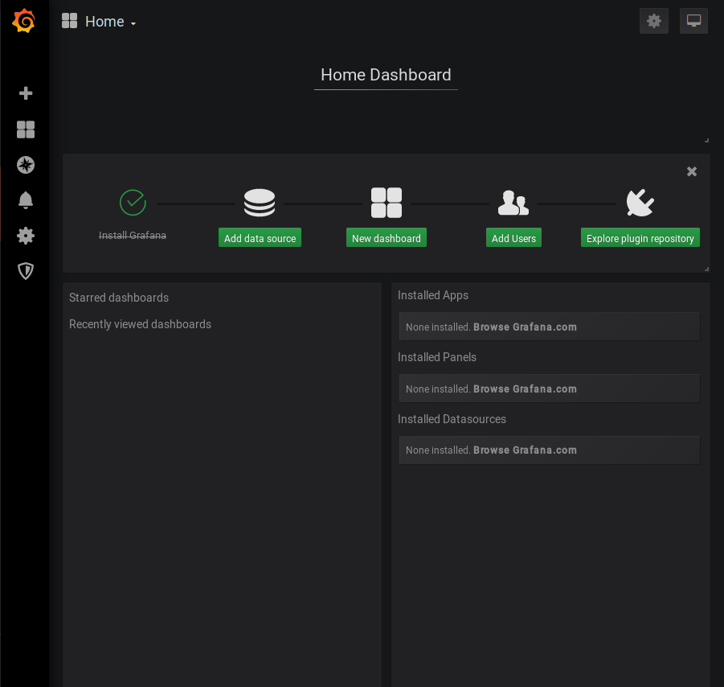

## 1. Chuẩn bị ##

- Ubuntu 16.04 LTS
- CPU: 1 vCPU
- Memory: 1GB RAM
- Disk: 2.5-5GB tùy thuộc vào số node monitor
- Disk performance: 20-200 random IOPs trên mỗi node server monitor.
- Use NetApp storage (NFS, LUN, vmdk, vhd, vhdx) hoặc local SSD

Cài đặt cơ bản: Cấu hình IP, kiểm tra kết nối internet, firewall, đồng bộ thời gian, update...

## 2. Cài đặt grafana ##

Tải grafana ver 5.4
```sh
sudo yum install https://s3-us-west-2.amazonaws.com/grafana-releases/release/grafana-5.1.4-1.x86_64.rpm

wget https://s3-us-west-2.amazonaws.com/grafana-releases/release/grafana-5.1.4-1.x86_64.rpm

sudo yum install initscripts fontconfig
```

Cài đặt từ repo

Tạo file mới /etc/yum.repos.d/grafana.repo

```sh
cat << EOF >> /etc/yum.repos.d/grafana.repo
[grafana]
name=grafana
baseurl=https://packages.grafana.com/oss/rpm
repo_gpgcheck=1
enabled=1
gpgcheck=1
gpgkey=https://packages.grafana.com/gpg.key
sslverify=1
sslcacert=/etc/pki/tls/certs/ca-bundle.crt
EOF
```

Cài đặt Grafana
```sh 
yum update -y 
yum -y install grafana
```

Khởi động và enable Grafana
```sh 
systemctl daemon-reload
systemctl start grafana-server
systemctl status grafana-server
systemctl enable grafana-server.service
```

Truy cập giao diện quản trị grafana với tài khoản `admin/admin`
```sh
http://ip_server:3000 
```
<p align="center">

</p>

> Truy cập lần đầu sẽ yêu cầu bạn thay đổi password mặc định

<p align="center">

</p>

Giao diện 
<p align="center">

</p>

## Tài liệu tham khảo 

https://grafana.com/docs/installation/rpm/